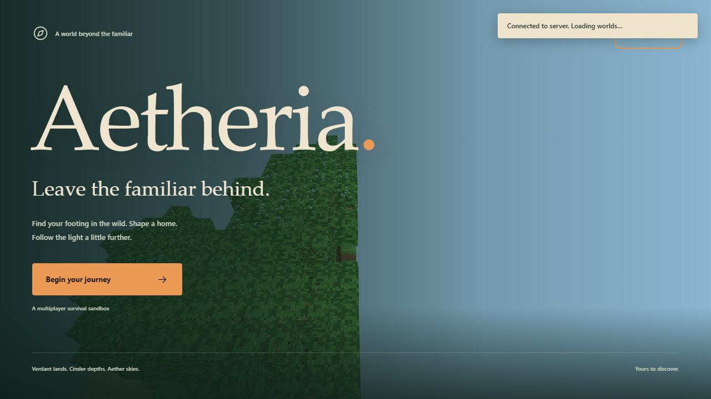
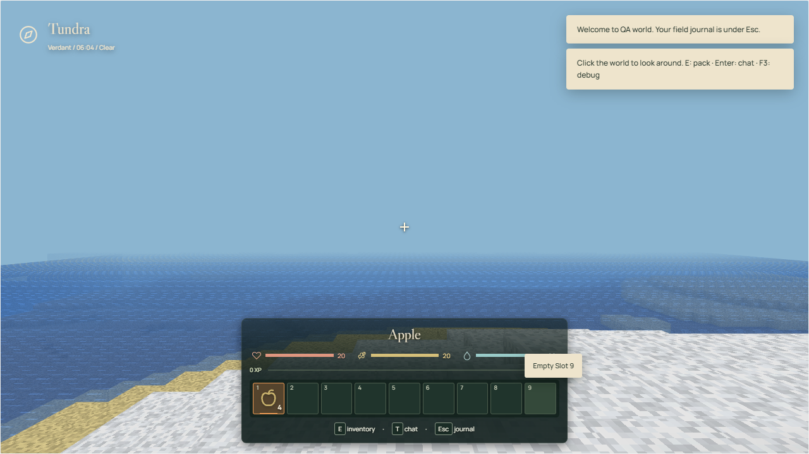
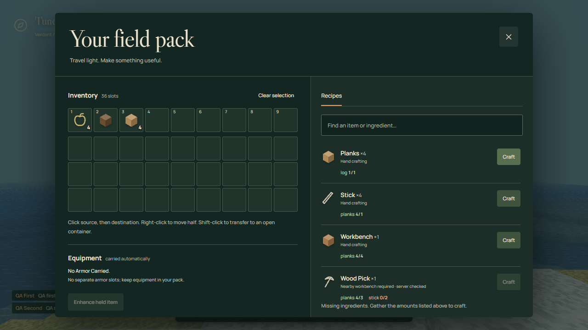

# Aetheria

**Explore. Build. Survive. Cross worlds.**

Make a home in the Verdant wilds, descend into Cinder caverns, and find your way to the floating islands of Aether. Aetheria is an original multiplayer voxel survival sandbox built with TypeScript, Three.js, and a persistent Node.js server.

[Frontend preview](https://aetheria-aryam.vercel.app) · [Quick start](#quick-start) · [Development guide](docs/development.md) · [Worklog](docs/worklog.md)

The public deployment is currently a **frontend preview**, not an online multiplayer game: no multiplayer backend is connected, and `/ws` returns 404 there. Run locally to play.



## A world to make your own

- **Explore three realms:** seeded biomes, coastlines, caves, ores, trees, settlements, and ruins in Verdant; underground Cinder terrain; floating Aether islands.
- **Gather and build:** mine blocks, manage your pack, craft from recipes, smelt in a forge, and store supplies in chests.
- **Survive together:** server-authoritative movement and actions, shared worlds, chat, hunger, health, carried armor, basic creatures, and death/respawn.
- **Keep your journey:** world edits and player progress persist on the server; your browser remembers your explorer identity.

This is an actively developed prototype. The core has automated coverage and a focused local browser smoke; the [roadmap](#status-and-roadmap) distinguishes that from features still awaiting full playtesting.

## Screenshots

Actual captures from a local browser gameplay session, not mockups or the public deployment. The crafting check supplied two logs through a server-side test fixture, then crafted planks through the real UI; it does not demonstrate gathering those logs.

### Verdant shoreline



### Your field pack



## Quick start

Use **Node.js 24**, npm, and a desktop browser with WebGL2, keyboard, and mouse.

```sh
git clone https://github.com/aryamthecodebreaker/Aetheria.git
cd Aetheria
npm install
npm run build
npm run server
```

Open **http://localhost:7777** and keep the server running. Choose **Begin your journey**, enter an explorer name, and create or join a world. Click the game to capture your mouse.

The Node process serves the built frontend and the `/ws` WebSocket endpoint. Rebuild after client changes. The server runs TypeScript through `tsx`, so do not omit development dependencies from this startup flow.

### Controls

| Input | Action |
| --- | --- |
| Mouse / W A S D | Look / move |
| Space | Jump or swim up; double-press to toggle creative flight |
| Ctrl / Shift | Sprint / crouch; Shift descends in flight |
| Hold left mouse | Mine; click a creature to attack |
| Right mouse | Use, trade, eat held food, or place a block, depending on context |
| Shift + right mouse | Place a held block against a container without opening it |
| 1–9 / mouse wheel | Select hotbar slot |
| E | Open inventory and recipes |
| T / Enter | Chat and commands |
| Q | Drop the entire held stack |
| F / F3 | Toggle HUD / debug statistics |
| Esc | Release mouse or open/close the journal menu |

In the pack, click source then destination; right-click to split a stack. Shift-click to deposit into an open container, and click its slots to withdraw. Recipes consume ingredients directly from the pack; some require a nearby visible workbench. This is recipe-based crafting, not a shaped crafting grid. Armor works automatically while carried. Menus stop your input, not the multiplayer simulation.

Enter `/help` in chat for commands. Other commands, including `/save`, `/mode`, `/give`, and `/rules`, require the world creator's profile.

## Development

Run these in separate terminals:

```sh
npm run server:watch
```

```sh
npm run dev
```

Open http://localhost:5173. Vite proxies `/ws` to the local backend on port 7777; leave the server address at its default. Server restarts disconnect players.

| Script | Purpose |
| --- | --- |
| `npm run dev` | Vite development frontend |
| `npm run server` | Persistent HTTP/WebSocket game server |
| `npm run server:watch` | Restart server on source changes |
| `npm run build` | Build frontend into `dist/` |
| `npm run typecheck` | TypeScript checking without emitting files |
| `npm run lint` | ESLint with zero warnings allowed |
| `npm test` | Vitest unit and integration suites |

See [development and QA](docs/development.md) for deployment, saves, reproduction commands, test evidence, and remaining gaps.

## Configuration and hosting

| Setting | Where / when | Default |
| --- | --- | --- |
| `VITE_SERVER_URL` | Frontend, at Vite build time | Page origin; root addresses become `/ws` |
| `PORT` | Server process | `7777` |
| `SAVE_DIR` | Server process | `./saves`, relative to the working directory |
| `ALLOWED_ORIGINS` | Server process | Empty; same-host browser connections remain allowed |

For a separately hosted frontend, set `VITE_SERVER_URL` to **your actual backend's HTTPS address or WSS endpoint**, then rebuild/redeploy the frontend. No public backend endpoint is currently provided. An HTTPS page requires WSS; an insecure local WebSocket address will not work from the preview.

On that backend, set `ALLOWED_ORIGINS=https://aetheria-aryam.vercel.app` to allow the exact frontend origin. Multiple origins are comma-separated HTTP(S) origins without paths, trailing slashes, credentials, or wildcards. The server-address field also permits explicitly choosing a backend without rebuilding.

The backend needs a **persistent Node host, WebSocket upgrade support, and persistent disk** for saves. Static hosting or serverless functions are not a substitute for this long-running game server. Terminate TLS at your host or reverse proxy; the application itself listens over HTTP. The server script does not automatically load `.env`; set its variables in the launching shell or host configuration. Vite handles its own frontend environment files.

Browser identity is a local bearer token, not a full account system. Clearing site data loses that identity. Use trusted local/LAN hosting until authentication, access control, and deployment hardening meet your needs; an origin allowlist is not authentication.

## Status and roadmap

| Status | Scope |
| --- | --- |
| **Working core, automated coverage** | Seeded world generation, chunk streaming/meshing, inventory and crafting transactions, server-authoritative actions and movement, armor, saves/backup recovery, and WebSocket integration |
| **Observed in local browser smoke** | World creation, two independent players joining, bidirectional chat, fixture-backed crafting, and reload/rejoin retaining identity and crafted inventory |
| **Experimental; tests exist, full manual playthrough pending** | Boss encounters, beds/group sleep, circuits and doors, hopper transfers, crop growth/harvesting, and workbench repair |
| **Not implemented as complete systems** | Player-fired projectiles, vehicles/rail simulation, dynamic fluid simulation, propagated voxel lighting, mobile/touch gameplay, shaped crafting, villager professions/schedules, raids, and alchemy |

The latest recorded test run on **2026-09-17** passed **198 tests across 10 files**; this is a dated result, not a fixed total or a guarantee for later revisions. The local browser smoke passes end to end, including a real movement check, and reports only an expected Vite ws-proxy `ECONNRESET` during teardown. See the [worklog](docs/worklog.md) for check results, including any later runs.

## Contributing

Try a local world, report a reproducible issue, or improve one small system. Include the seed, realm, game mode, browser/Node versions, steps, and expected versus observed behavior. Never attach saves, bearer tokens, or browser-storage exports to public reports. Run typecheck, lint, tests, and build before submitting a change; document any manual checks separately.

- `client/` — UI, input, networking, presentation, and worker rendering.
- `server/` — authoritative simulation, actions, machines, and persistence.
- `shared/` — types, registries, recipes, generation, physics, and codecs.
- `tests/` — core and integration tests; client tests also live beside client code.
- `tools/` — browser smoke and deployment inspection scripts.
- [Research](docs/research.md) — technical references and architectural tradeoffs.

## License

`package.json` declares MIT. A standalone `LICENSE` file was not present at this documentation snapshot; adding the license text is pending with the repository maintainer.
